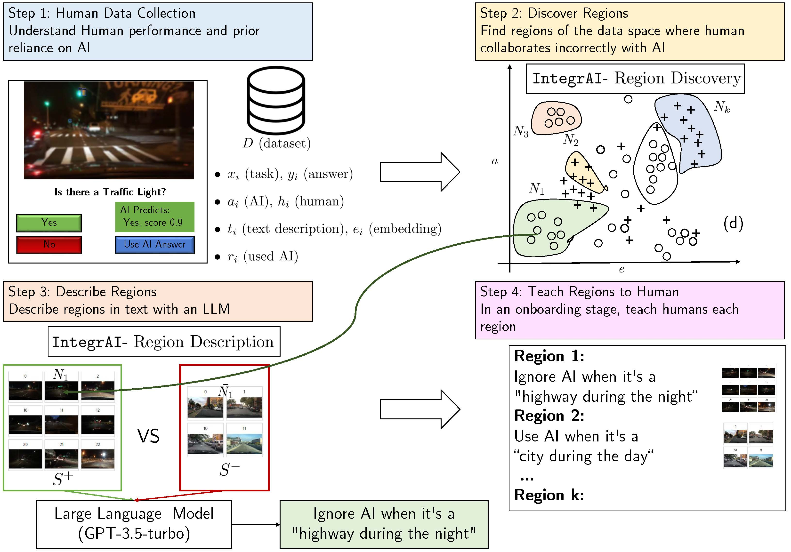

# IntegrAI: Effective Human-AI Teams via Learned Natural Language Rules and Onboarding


Associated code for paper [Effective Human-AI Teams via Learned Natural Language Rules and Onboarding](https://arxiv.org/abs/2311.01007)  published in NeurIPS 2023 (spotlight). 


# What is it?


People are relying on AI agents to assist them with various tasks. The human must know when to
rely on the agent, collaborate with the agent, or ignore its suggestions. Our procedure gives a way to understand better how the human and the AI should collaborate.


The first piece is the human's prior knowledge and trust of the AI, i.e., does the human trust the AI on all the data, never trust the AI, or trust the AI on only a subset of the data? Given the human's prior, we discover and describe regions of the data space that disprove the human's prior. For example, if human always trusted AI, we find a (or many) subset (s) of the data and describe it in natural language where the AI has worse performance than the human (and vice versa).


Concretely, our procedure is composed of two parts:

- A region discovery algorithm (IntegrAI-discover) that discovers such subsets of the data space as local neighborhoods in a cross-modal embedding space.

- A region description algorithm (IntegrAI-describe) that describes these subsets in natural language using large language models (LLMs).

Each of these algorithms is implemented in this repo as well as baseline approaches with multiple datasets to test them on. 

The algorithm IntegrAI can be used to compare two models or look at the errors of a single model. 

For a demo, see [colab jupyter notebook](https://colab.research.google.com/drive/1L22IX965T_fzbMP7BNAH7PkhJYW2Ekrg?usp=sharing). The main code is in the folder [integrai](integrai)




# Installation

Clone the repo:
```bash
git clone https://github.com/clinicalml/onboarding_human_ai.git
```

For using the IntegrAI algorithm and the demo, the following requirements suffice:

```bash
pip install -r requirements.txt
```

For replicating the paper results:


cd into the repo and create a new conda environment (Python 3.8.13) from our environment.yml file:

```bash
conda env create -f environment.yml
```

Finally, activate the environment:
```bash
conda activate onboardai
```

To download pre-processed datasets and user study data, use this Google storage link https://storage.googleapis.com/public-research-data-mozannar/data_saved_onboarding.zip


# Demo and Guide

For an example of how to use IntegrAI, we provide an example on an image classification task in the notebook [demo_imagenet.ipynb](demo_imagenet.ipynb). For a Colab version, please check [colab jupyter notebook](https://colab.research.google.com/drive/1L22IX965T_fzbMP7BNAH7PkhJYW2Ekrg?usp=sharing)


An NLP demo will soon be provided as well.


# Organization

This code repository is structured as follows:


- in [integrai](integrai) we have a minimal code implementation of our algorithm IntegrAI - if you're just interested in applying the method, only look at this folder

- in [src](src) we have the code for the core functionalities of our algorithms for the paper organized as follows:

    -[src/datasets_hai](src/datasets_hai) has files for each dataset used in our method and code to download and process the datasets.
    
    -[src/describers](src/describers) has files for each region description method in our paper
    
    -[src/teacher_methods](src/teacher_methods) has files for each region discovery method in our paper
    
    -[src/teacher_methods](src/human_ai_card) has a notebook to showcase the human-AI card
    
- in [interface_user_study](interface_user_study) we have the raw code for the interfaces used in the BDD and MMLU user studies (with Firebase)

- in [experiments](experiments) we have jupyter notebooks to reproduce the results in Section 6 (method evaluation)

- in [user_study_analysis](user_study_analysis) we have jupyter notebooks to reproduce the results in Section 7 (user study results)


# Paper Reproducibility 

To reproduce figures and results from the paper, you can run the following notebooks:

- Table 3 and Figure 4 [./experiments/learning_accurate_integrators.ipynb](./experiments/learning_accurate_integrators.ipynb) and [,/experiments/plot_results.ipynb](./experiments/plot_results.ipynb)

- Table 4: [./experiments/uncovering_regions.ipynb](./experiments/uncovering_regions.ipynb)

- Table 5 [./experiments/describing_regions.ipynb](./experiments/describing_regions.ipynb)

- Table 6 [./user_study_analysis/bdd_study.ipynb](./user_study_analysis/bdd_study.ipynb)

- Table 7 [./user_study_analysis/mmlu_study.ipynb](./user_study_analysis/mmlu_study.ipynb)

Note: all experiments involve randomness, so results are not deterministic. 

# Citation

```
@article{mozannar2023effective,
     title={Effective Human-AI Teams via Learned Natural Language Rules and Onboarding}, 
      author={Hussein Mozannar and Jimin J Lee and Dennis Wei and Prasanna Sattigeri and Subhro Das and David Sontag},
      year={2023},
      journal={Advances in Neural Information Processing Systems}
}
```

# Acknowledgements

This work is partially funded by the MIT-IBM Watson AI Lab.

